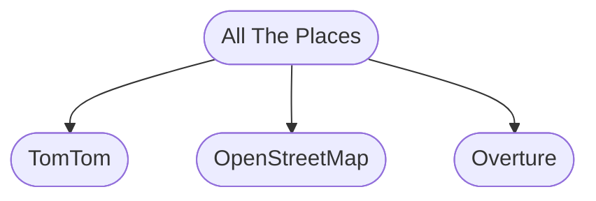

# All the Places


A project to generate [point of interest (POI)](https://en.wikipedia.org/wiki/Point_of_interest) data sourced [from websites](docs/WHY_SPIDER.md) with 'store location' pages. The project uses [`scrapy`](https://scrapy.org/), a popular Python-based web scraping framework, to execute individual site [spiders](https://doc.scrapy.org/en/latest/topics/spiders.html) that retrieve POI data, publishing the results in a [standard format](DATA_FORMAT.md). There are various `scrapy` tutorials on the Internet and [this series on YouTube](https://www.youtube.com/watch?v=s4jtkzHhLzY) is reasonable.


## Getting started

### Development setup

Windows users may need to follow some extra steps, please follow the [scrapy docs](https://docs.scrapy.org/en/latest/intro/install.html#windows) for up to date details.

#### Ubuntu

These instructions were tested with Ubuntu 24.04 LTS on 2024-02-21.

1. Install `uv`:

   ```
   curl -LsSf https://astral.sh/uv/install.sh | sh
   source $HOME/.local/bin/env
   ```

1. Clone a copy of the project from the [All the Places](https://github.com/alltheplaces/alltheplaces/) repo (or your own fork if you are considering contributing to the project):

   ```
   git clone git@github.com:alltheplaces/alltheplaces.git
   ```

1. Use `uv` to install the project dependencies:

   ```
   cd alltheplaces
   uv sync
   ```

1. Test for successful project installation:

   ```
   uv run scrapy
   ```

   If the above runs without complaint, then you have a functional installation and are ready to run and write spiders.

#### macOS

These instructions were tested with macOS 15.3.2 on 2025-04-01.

1. Install `uv`:

   ```
   brew install uv
   ```

1. Clone a copy of the project from the [All the Places](https://github.com/alltheplaces/alltheplaces/) repo (or your own fork if you are considering contributing to the project):

   ```
   git clone git@github.com:alltheplaces/alltheplaces.git
   ```

1. Use `uv` to install the project dependencies:

   ```
   cd alltheplaces
   uv sync
   ```

1. Test for successful project installation:

   ```
   uv run scrapy
   ```

   If the above runs without complaint, then you have a functional installation and are ready to run and write spiders.

#### Codespaces

You can use GitHub Codespaces to run the project. This is a cloud-based development environment that is created from the project's repository and includes a pre-configured environment with all the tools you need to develop the project. To use Codespaces, click the button below:

   [](https://codespaces.new/alltheplaces/alltheplaces)

#### Docker

You can use Docker to run the project. This is a container-based development environment that is created from the project's repository and includes a pre-configured environment with all the tools you need to develop the project.

1. Clone a copy of the project from the [All the Places](https://github.com/alltheplaces/alltheplaces/) repo (or your own fork if you are considering contributing to the project):

   ```
   git clone git@github.com:alltheplaces/alltheplaces.git
   ```

1. Build the Docker image:

   ```
   cd alltheplaces
   docker build -t alltheplaces .
   ```

1. Run the Docker container:

   ```
   docker run --rm -it alltheplaces
   ```

### Contributing code

Many of the sites provide their data in a [standard format](docs/STRUCTURED_DATA.md). Others export their data [via simple APIs](docs/API_SPIDER.md). We have a number of guides to help you develop spiders:

* [What should I call my spider?](docs/SPIDER_NAMING.md)
* [Using Wikidata and the Name Suggestion Index](docs/WIKIDATA.md)
* [Sitemaps make finding POI pages easier](docs/SITEMAP.md)
* [Data from many POI pages can be extracted without writing code](docs/STRUCTURED_DATA.md)
* [What is expected in a pull request?](docs/PULL_REQUEST.md)
* [What we do behind the scenes](docs/PIPELINES.md)

### The weekly run

The output from running the project is [published on a regular cadence](docs/WEEKLY_RUN.md) to our website: [alltheplaces.xyz](https://www.alltheplaces.xyz/). You should not run all the spiders to pick up the output: the less the project "bothers" a website the more we will be tolerated.

## Contact us

Communication is primarily through tickets on the project GitHub [issue tracker](https://github.com/alltheplaces/alltheplaces/issues). Many contributors are also present on [OSM US Slack](https://slack.openstreetmap.us/), in particular we watch the [#poi](https://osmus.slack.com/archives/CDJ4LKA2Y) channel.

## License

The data generated by our spiders is provided [on our website](https://alltheplaces.xyz/) and released under [Creative Commons’ CC-0 waiver](https://creativecommons.org/publicdomain/zero/1.0/).

The [spider software that produces this data](https://github.com/alltheplaces/alltheplaces) (this repository) is licensed under the [MIT license](https://github.com/alltheplaces/alltheplaces/blob/master/LICENSE).
